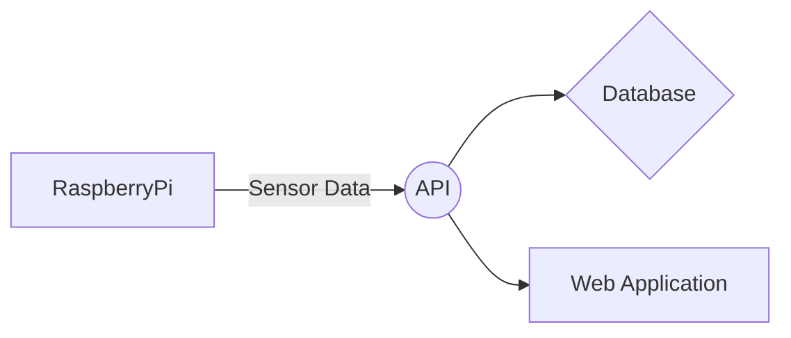

# AirQualityPi Sensors

The is a small part of the [AirQualityPi](https://airqualitypi.com) project. The idea of this script is to read data from the PMS5003 Particle Matter Sensor as well as the BME680 Sensor and then send this data to the [AirQualityPiAPI](https://github.com/Kingy/AirQualityPiAPI).

# Sensor Setup

I've written a full [blog post](https://www.devhour.net/monitoring-air-quality-with-a-raspberry-pi-pms5003-sensor/) on what hardware is required and the entire setup including wiring guide and software installation.

# Installation

Follow the below instructions on installing and running this project

    git clone https://github.com/Kingy/AirQualityPiSensors.git
    cd AirQualityPiAPI
    python3 -m venv .venv
    source .venv/bin/activate
    pip install -r requirements.txt
    cp .env.example .env

Make sure you edit the .env file and populate the environment variables as necessary. 

    python Sensors.py

### Cron Setup

To read the sensor data on a consistent basis I suggest running it via a cron job. For example every 15 minutes:

    */15 * * * * /path/to/.venv/bin/python3 /path/to/Sensors.py

